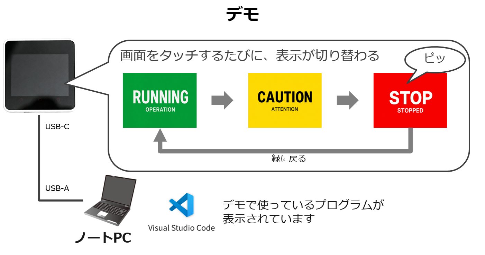

# M5Stack Core2 Touch Demo

JDLAワークショップの冒頭で使用する、M5Stack Core2 v1.3向けのタッチデモです。PlatformIOとArduino Frameworkでビルドできます。

## 動作



Core2をUSB-CケーブルでノートPCへ接続し、Visual Studio Code／PlatformIOからプログラムを書き込みます。

画面をタッチするたびに、次の順番で表示が切り替わります。

1. 緑：`RUNNING / OPERATION`
2. 黄：`CAUTION / ATTENTION`
3. 赤：`STOP / STOPPED`
4. 緑へ戻る

赤のSTOP画面へ切り替わるときだけ、2,000 Hz・100 msの短い音が鳴ります。

## 書き込み手順

1. Visual Studio Codeでこのフォルダを開く
2. PlatformIOが依存ライブラリを取得するまで待つ
3. Core2とPCをデータ通信対応USB-Cケーブルで接続する
4. PlatformIOの`Upload`を実行する
5. ターミナルに`SUCCESS`と表示されたら、画面をタッチして動作を確認する

PlatformIO CLIでは次のコマンドを使えます。

```bash
pio run
pio run --target upload
```

## ワークショップでの変更

`src/main.cpp`の次の値を30から100へ変更して再転送し、通知音の違いを確認します。

```cpp
constexpr uint8_t SPEAKER_VOLUME = 30;
```

設定範囲は0～255です。周囲に配慮し、必要以上に大きな値へ設定しないでください。
